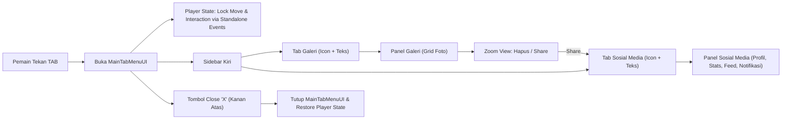

# 📸 Rencana Pengembangan Fitur Photo Mode & In-Game Social Media (Standalone & Cross-Platform)

Dokumen ini berisi perencanaan sistematis, arsitektur data, tata letak UI, strategi **Cross-Platform (Windows Standalone & WebGL)**, serta pembagian task untuk fitur pemotretan (*In-Game Photo Mode*), galeri foto, deteksi objek berkategori (`ObjectValue`), dan simulasi sosial media in-game.

---

## 🛡️ Prinsip Desain Standalone (Zero-Intrusion Architecture)

Untuk memastikan fitur ini **bisa berdiri sendiri tanpa mengubah atau merusak kode yang sudah ada** di dalam project:

1. **Isolasi Total Modul**:
   - Seluruh script, prefab, UI Canvas, dan ScriptableObject akan berada dalam satu folder terisolasi: `Assets/PhotoModeSystem/`.
   - Menggunakan `namespace PhotoModeSystem` agar tidak ada bentrok nama kelas (*naming collision*) dengan script yang sudah ada.

2. **Tanpa Modifikasi Script Player / Game Core**:
   - **TIDAK ADA** edit/modifikasi pada script player controller atau script game utama yang sudah ada.
   - Sistem penguncian pergerakan/interaksi dilakukan melalui event terlepas (*Decoupled Event-Driven*):
     - `PhotoModeEvents.OnPhotoModeStateChanged(bool isOpen)` -> Player controller bawaan project dapat mendengarkan event ini secara opsional, ATAU sistem `PhotoModePlayerLock` bawaan modul ini akan menangani `Cursor.lockState` dan `Time.timeScale` / Input blocker secara mandiri tanpa menyentuh script lama.

3. **Plug-and-Play Component**:
   - Component `ObjectValue.cs` berdiri sendiri dan dapat langsung ditempelkan (*Add Component*) ke GameObject apapun di scene tanpa mengubah script bawaan GameObject tersebut.

---

## 🖥 Layout UI Utama: Unified Tab Menu System (Akses Tombol TAB)

Saat pemain menekan tombol **`TAB`**, sebuah jendela antarmuka terpadu (*Unified Overlay Window*) akan terbuka dengan tata letak sebagai berikut:

```
+-------------------------------------------------------------------------+
| [MAIN TAB MENU]                                                 [ X ]   |
|                                                                (Close)  |
| +-----------------+ +-------------------------------------------------+ |
| |  [ 🖼️ Icon ]     | |                                               | |
| |     Galeri      | |                                               | |
| |                 | |              MAIN CONTENT AREA                | |
| |  [ 🌐 Icon ]     | |   (Menampilkan Panel Galeri ATAU Panel Social) | |
| |  Sosial Media   | |                                               | |
| +-----------------+ +-------------------------------------------------+ |
+-------------------------------------------------------------------------+
```

### 1. Panel Sidebar Kiri (Navigation Tabs)
* **Tombol Tab 1: Galeri**
  * Tampilan: **Icon Galeri** dengan **Teks "Galeri"** di bawahnya.
  * Fungsi: Mengaktifkan `GalleryPanel` (menampilkan grid foto hasil jepretan).
* **Tombol Tab 2: Sosial Media**
  * Tampilan: **Icon Sosial Media** dengan **Teks "Sosial Media"** di bawahnya.
  * Fungsi: Mengaktifkan `SocialMediaPanel` (menampilkan profil, statistik followers/likes, feed postingan, dan notifikasi).

### 2. Header Kanan Atas (Top-Right Close Button)
* **Tombol Close ("X")**:
  * Tampilan: Tombol ikon silang **X** di sudut kanan atas.
  * Fungsi: Menutup seluruh tampilan `MainTabMenuUI` dan mengembalikan status game:
    * Mengaktifkan kembali pergerakan pemain (*Player Movement Unlocked*).
    * Mengaktifkan kembali sistem interaksi (*Player Interaction Unlocked*).
    * Mengunci kursor mouse kembali ke mode game (*Cursor Locked & Hidden*).

---

## 🌐 Strategi Cross-Platform (Windows & WebGL Support)

Untuk memastikan sistem berjalan mulus baik di **Windows Standalone** maupun **WebGL**, fitur menggunakan pengkondisian platform (*Conditional Compilation* `#if UNITY_WEBGL` / `#if UNITY_STANDALONE_WIN`).

### 1. Metode Screenshot Multi-Platform
* **Windows Standalone**: Menggunakan `ScreenCapture.CaptureScreenshotAsTexture()` / `RenderTexture` -> PNG (`EncodeToPNG()`).
* **WebGL Build**: Menggunakan `ScreenCapture.CaptureScreenshotAsTexture()` / `RenderTexture` -> JPG (`EncodeToJPG(75)`) untuk menghemat konsumsi RAM WASM Heap dan ruang penyimpanan browser (IndexedDB).

### 2. Penyimpanan Data (Cross-Platform Storage)
* Selalu menggunakan `Application.persistentDataPath + "/Photos/"`.
  * **Windows**: `%userprofile%\AppData\LocalLow\<Company>\<Product>\Photos\`
  * **WebGL**: Dipetakan otomatis oleh Emscripten ke **IndexedDB**.

---

## 📌 Ringkasan Alur Fitur (Feature Overview)

1. **Pemotretan (Enter)**:
   - Pemain menekan `Enter` -> Mengambil snapshot layar.
   - Menyimpan file gambar (.png di Windows / .jpg di WebGL) dan JSON metadata di `persistentDataPath`.
   - Memunculkan animasi UI Canvas berupa bingkai putih yang mengecil dan meluncur ke bawah (*slide down*).
   - Input potret terkunci (*cooldown/locked*) selama animasi berlangsung.

2. **Deteksi Metadata (`ObjectValue`)**:
   - Mengidentifikasi `GameObject` dengan script `ObjectValue` di layar (*frustum planes check* & *occlusion check*).

3. **Menu Utama TAB (Galeri & Sosial Media)**:
   - Menekan `Tab` atau mengklik **X** membuka/menutup `MainTabMenuUI`.
   - Di sebelah kiri terdapat 2 Tombol Tab (Icon + Teks): **Galeri** dan **Sosial Media**.
   - Di kanan atas terdapat tombol **X** untuk keluar dan mengembalikan kendali pergerakan & interaksi.
   - Pada panel Galeri: Foto dapat diklik untuk **Zoom**, **Hapus**, atau **Share** ke Sosial Media.

4. **Sosial Media & Algoritma Impact**:
   - Menekan **Share** dari foto akan memindahkan tampilan ke Tab Sosial Media.
   - **Rumus Algoritma (Inspector Configurable)**:
     - **Image Value** = Total penjumlahan `ObjectValue` di foto.
     - **Followers Baru** = `Random(MinFollowerRatio, MaxFollowerRatio) * Image Value` (Default: `0.5` - `0.75`).
     - **Likes** = `Random(MinLikeRatio, MaxLikeRatio) * Total Followers` (Default: `0.75` - `2.0`).
     - **Gold Donasi** = `Random(MinGoldRatio, MaxGoldRatio) * 100 * Total Followers` (Default: `0.75` - `2.0`).

5. **Menu Notifikasi**:
   - Menampilkan ulasan donasi Gold, statistik Likes, dan Followers baru di dalam panel Sosial Media.

6. **Desain Additive Scene Standalone (Tanpa Kamera)**:
   - Seluruh UI dan Manager dimasukkan ke dalam scene mandiri (`PhotoModeUI.unity`) yang siap di-load secara **Additive** (`LoadSceneMode.Additive`) ke scene utama.
   - Scene ini **TIDAK memiliki Main Camera** tersendiri (menggunakan `Camera.main` milik scene utama).

---

## 🏗 Arsitektur UI & Navigation Flow



---

## 🗂 Pembagian Task Pengerjaan (Task Breakdown - Standalone & Decoupled)

### 🔹 **Task 1: Standalone Cross-Platform Screenshot & Storage System**
* **Tujuan**: Membuat modul penyimpanan foto terisolasi di folder `Assets/PhotoModeSystem/`.
* **Langkah Kerja**:
  1. Buat `PhotoData.cs` (Data Model JSON di `PhotoModeSystem` namespace).
  2. Buat `PhotoStorageManager.cs` (PNG di Windows, JPG 75 di WebGL).
  3. Simpan file gambar & JSON ke `Application.persistentDataPath + "/Photos/"`.

---

### 🔹 **Task 2: Object Recognition & Metadata Detector (`ObjectValue`)**
* **Tujuan**: Deteksi objek ber-script `ObjectValue` dalam pandangan kamera tanpa mengubah script objek tersebut.
* **Langkah Kerja**:
  1. Buat script `ObjectValue.cs` (`string objectName`, `float value`) - dapat ditempelkan langsung ke GameObject manapun.
  2. Buat `PhotoMetadataDetector.cs` dengan Frustum Planes Check & Linecast Occlusion Check (secara otomatis mengikat ke `Camera.main`).

---

### 🔹 **Task 3: Photo Capture UI Animation & Input Lock (Canvas)**
* **Tujuan**: Visual animasi pemotretan dan sistem penguncian input potret mandiri.
* **Langkah Kerja**:
  1. Buat Canvas Overlay (`PhotoCaptureUI.prefab`) dengan bingkai putih.
  2. Buat `PhotoAnimationController.cs` (Scale down + Slide down animation).
  3. Kelola `isPhotoProcessing` cooldown flag.

---

### 🔹 **Task 4: Standalone TAB Menu UI & Non-Intrusive Player State Controller**
* **Tujuan**: Tampilan Galeri & Tab Menu tanpa mengubah script Player Controller yang sudah ada.
* **Langkah Kerja**:
  1. Buat `PhotoModeStateBridge.cs`: Menyediakan C# `static event Action<bool> OnPhotoModeToggle;` untuk menginformasikan buka/tutup menu secara independen.
  2. Buat `MainTabMenuUI.cs`:
     - Menangani logika *Toggle* tombol `TAB`.
     - Menangani klik tombol **X** di kanan atas -> mentrigger pemulihan kursor mouse dan memanggil event penutupan.
     - Navigasi tab sidebar kiri (Button Galeri & Button Sosial Media) dengan **Icon + Teks**.
  3. Buat `GalleryPanelUI.cs` & `PhotoDetailUI.cs` (Grid thumbnail, Zoom, Hapus, Share, Pembersihan memori texture).

---

### 🔹 **Task 5: Social Media UI & Configurable Algorithm**
* **Tujuan**: Antarmuka Sosial Media (Profil, Feed, Notifikasi) dan perhitungan statistik terisolasi.
* **Langkah Kerja**:
  1. Buat `PhotoModeConfig.cs` (ScriptableObject) untuk mengatur batas min/max rasio di Inspector.
  2. Buat `SocialMediaManager.cs` untuk menghitung Followers, Likes, dan Gold.
  3. Buat `SocialMediaPanelUI.cs` untuk me-render data profil, grid feed postingan, serta tab notifikasi.

---

### 🔹 **Task 6: In-Game Notification System**
* **Tujuan**: Menampilkan rincian notifikasi aktivitas sosial media.
* **Langkah Kerja**:
  1. Buat `NotificationData.cs`.
  2. Buat `NotificationUIManager.cs` untuk me-render kartu notifikasi (Gold donasi, Likes, Followers baru) pada panel Sosial Media.

---

### 🔹 **Task 7: Cross-Platform Testing & Integration**
* **Tujuan**: Pengujian menyeluruh pada platform Windows Standalone dan WebGL Build.
* **Langkah Kerja**:
  1. Pengujian fungsi tombol `TAB` dan tombol **X** tanpa ada eror atau ketergantungan pada script luar.
  2. Verifikasi simpan/muat foto dan dampak share pada statistik sosial media di Windows & WebGL.

---

### 🔹 **Task 8: Standalone Additive Scene & Auto Installer (Tanpa Kamera)**
* **Tujuan**: Menyediakan Scene Additive Siap Pakai yang dapat dimasukkan ke project apapun tanpa mengubah satu baris pun kode lama.
* **Langkah Kerja**:
  1. Buat Scene `PhotoModeUI.unity` di dalam folder `Assets/PhotoModeSystem/Scenes/`:
     - **TIDAK ADA GameObject Camera** di scene ini (menggunakan `Camera.main` bawaan scene utama).
  2. Menata Struktur Hierarki Standalone:
     - `[PhotoMode_System]` (Manager Core)
     - `[Canvas_PhotoModeUI]` (UI Galeri, Sosial Media, Animasi Pemotretan)
  3. Sediakan loader satu baris (`PhotoModeAdditiveLoader.cs`):
     ```csharp
     // Cukup panggil baris ini dari mana saja tanpa perlu mengubah script lain
     UnityEngine.SceneManagement.SceneManager.LoadSceneAsync("PhotoModeUI", UnityEngine.SceneManagement.LoadSceneMode.Additive);
     ```
  4. Sediakan komponen sampel `ObjectValue` siap pakai untuk pengujian instan.

---

## 📅 Urutan Eksekusi Pengerjaan (Implementation Order)

```
[Task 1: Storage System] ───────> [Task 2: ObjectValue Detector]
                                             │
                                             ▼
[Task 4: Standalone TAB & Close X] <── [Task 3: Photo UI Animation]
          │
          ▼
[Task 5: Social Media System] ───> [Task 6: Notification Menu]
                                          │
                                          ▼
[Task 8: Standalone Additive Scene] ─> [Task 7: Integration & Testing]
```

---
*Dokumen ini menjamin 100% arsitektur Standalone (Zero-Intrusion) tanpa mengubah script yang sudah ada di project.*
